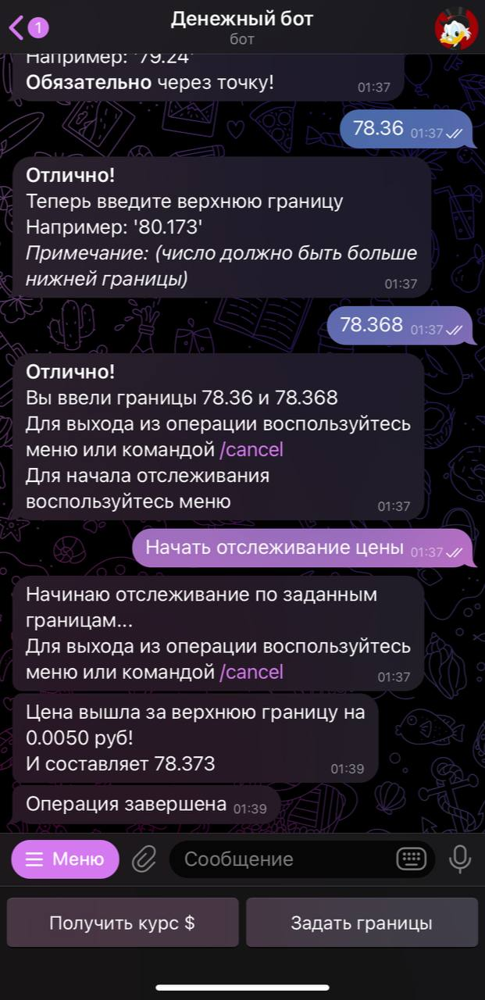

# Bot_aiogram
## Предназначение
Чат-бот присылающий курс доллара если он выйдет за заданные границы (2 границы верхняя и нижняя)
## Команды бота:

- `/start` — приветственное сообщение и вывод меню
- `/help` — информация о боте и контакты автора
- `/cancel` — отмена операции (выход из ввода границ или остановка отслеживания)
- `/get_price` — получить курс доллара
- `/set_limits` — установить граниицы 

## Запуск

Скопируйте `.env.example` в `.env` и отредактируйте `.env` файл, заполнив в нём все переменные окружения

## Скриншоты работы бота:

